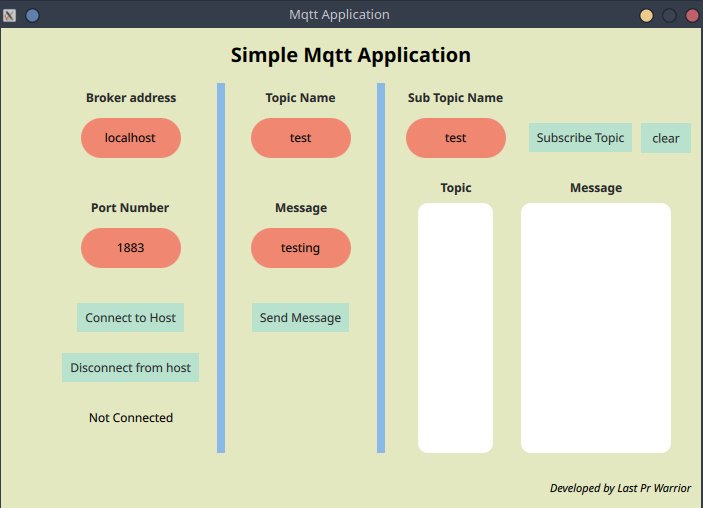

# Qt-Mqtt
Example Mqtt Application with Qt (C++ and Qml)

Application is using QMqttClient library. You should install this library to your system. 
You can check this link for how to install QMqttClient to Ubuntu.
https://stackoverflow.com/questions/66367858/install-mqtt-module-in-open-source-qt

